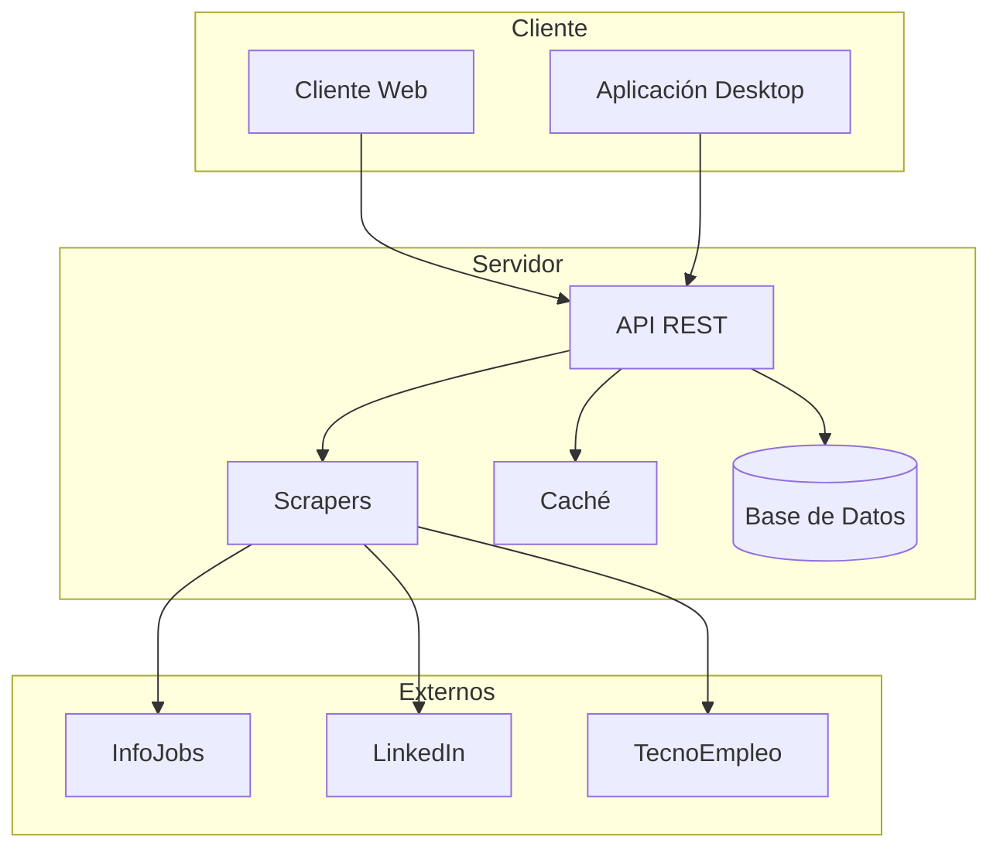
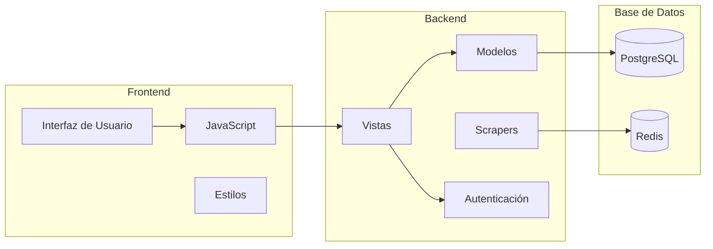
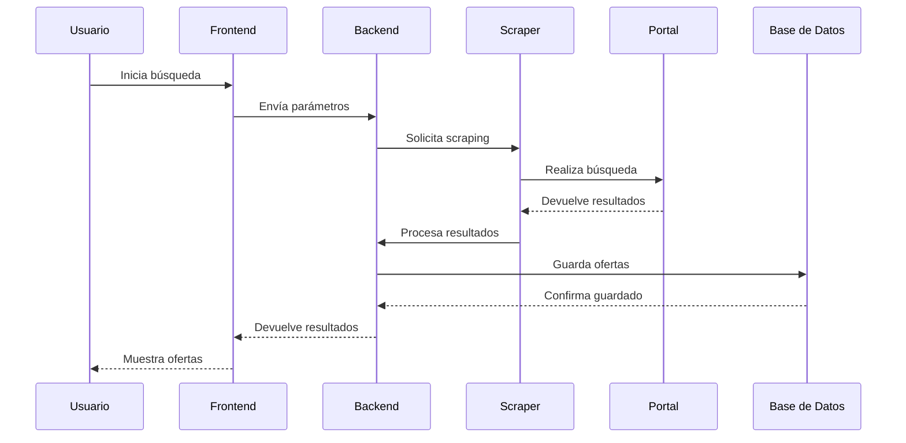
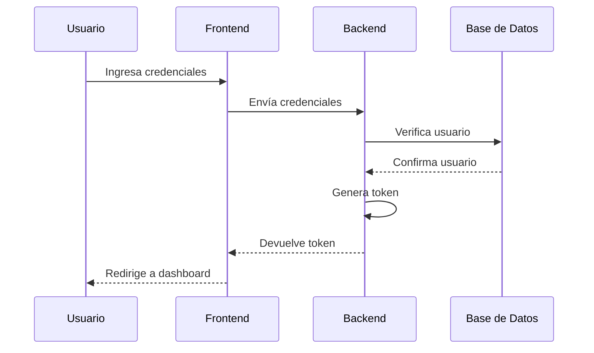
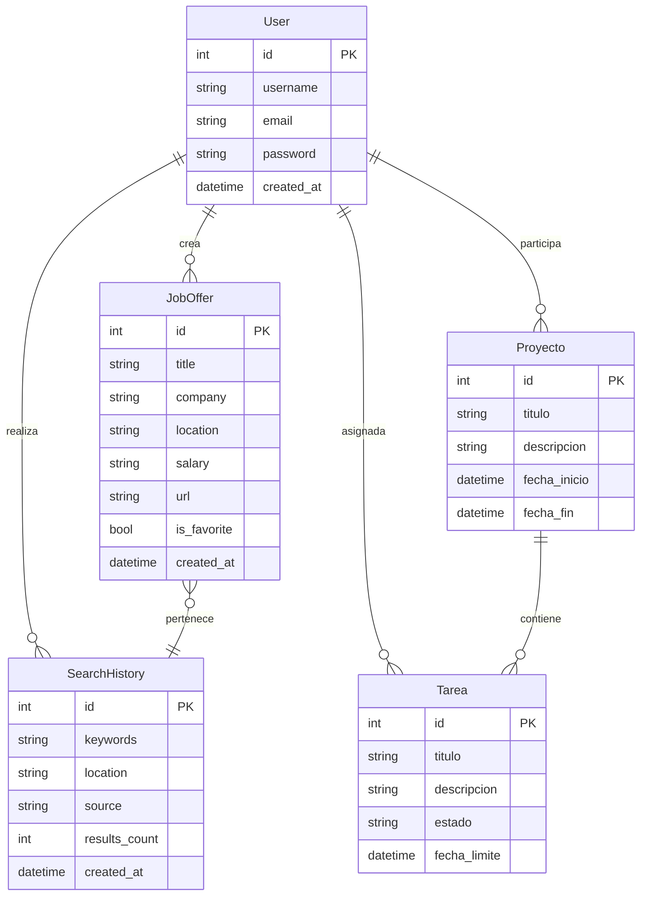
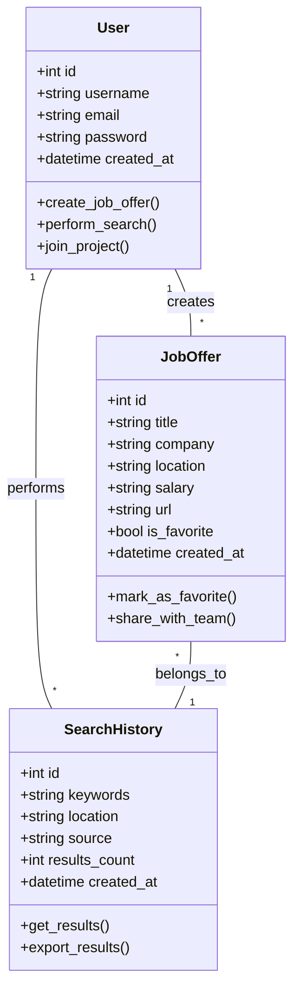
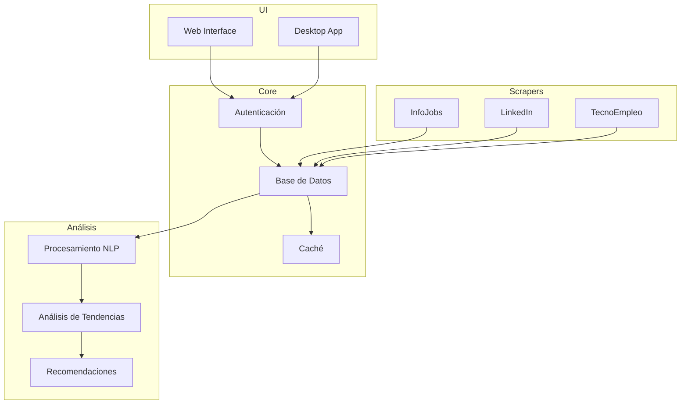
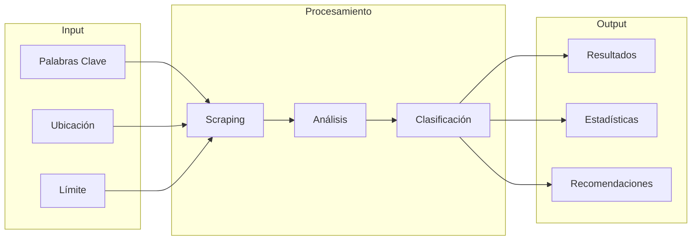
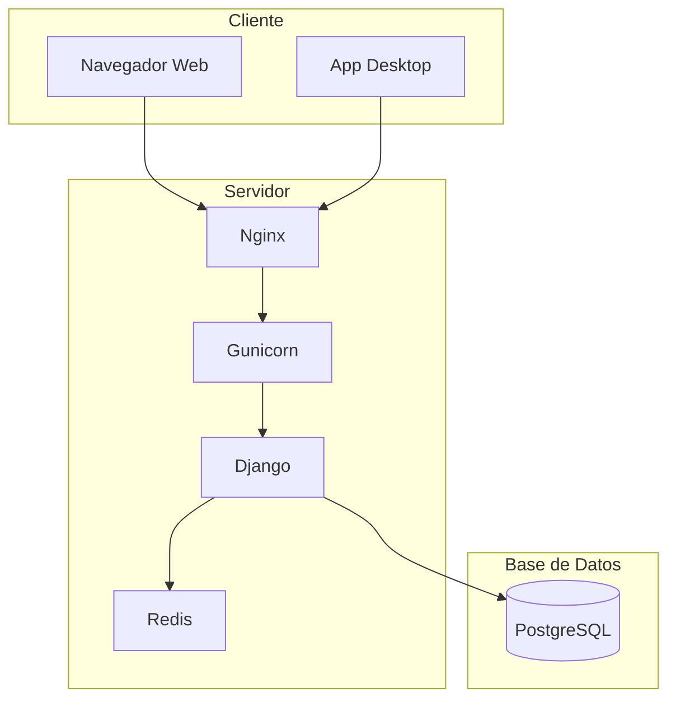
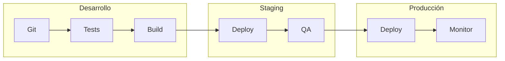

# Diagramas del Sistema: GML - Gestor de Ofertas de Trabajo

## 1. Diagramas de Arquitectura

### 1.1 Arquitectura General del Sistema

### 1.2 Arquitectura de Componentes

## 2. Diagramas de Flujo

### 2.1 Flujo de Búsqueda de Ofertas

### 2.2 Flujo de Autenticación

## 3. Diagramas de Base de Datos

### 3.1 Modelo Entidad-Relación Completo

### 3.2 Diagrama de Tablas

## 4. Diagramas de Componentes

### 4.1 Estructura de Módulos

### 4.2 Flujo de Datos

## 5. Diagramas de Despliegue

### 5.1 Arquitectura de Despliegue

### 5.2 Pipeline de CI/CD
