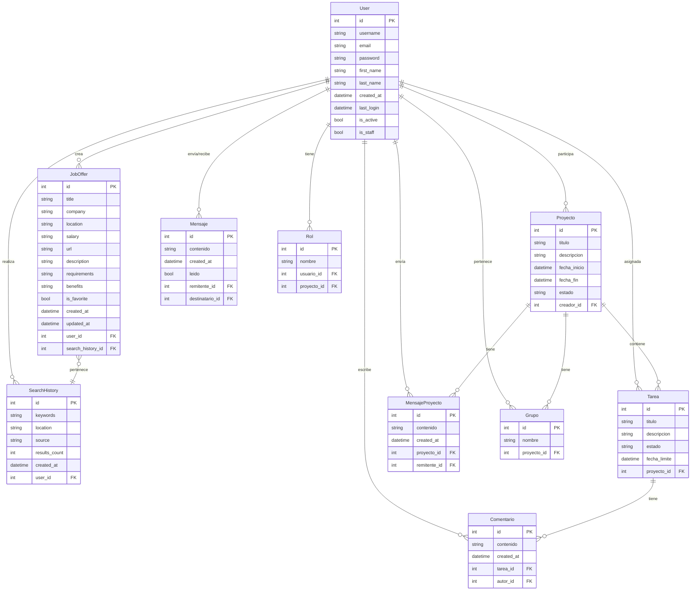
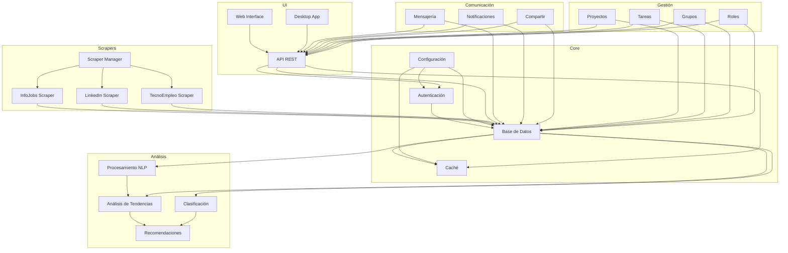
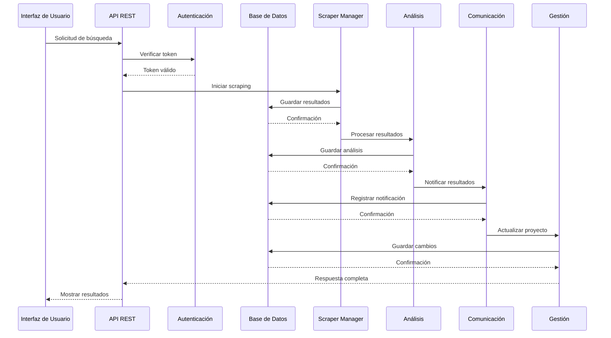
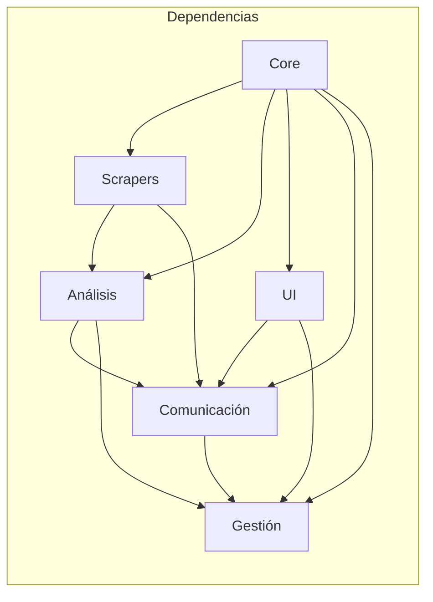

# Diagramas Detallados: GML - Gestor de Ofertas de Trabajo

## 1. Diagrama ER Detallado

## 2. Componentes Modulares y su Interacción

### 2.1 Arquitectura de Módulos

### 2.2 Flujo de Interacción entre Módulos

### 2.3 Dependencias entre Módulos
