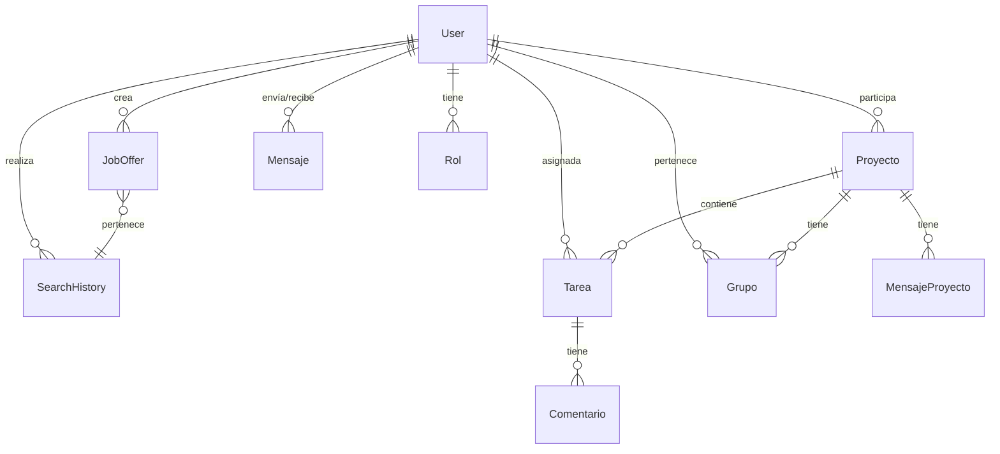

# Documentación Técnica: GML - Gestor de Ofertas de Trabajo

## 1. Arquitectura del Sistema

### 1.1 Arquitectura Web (Django)
```
[Cliente Web] <---> [Servidor Django] <---> [Base de Datos PostgreSQL]
     |                      |                      |
     |                      |                      |
[Scrapers] <------------> [APIs Externas] <----> [Cache]
```

#### Componentes principales:
- **Frontend**: Bootstrap 5 + jQuery + Chosen
- **Backend**: Django 5.1.6
- **Base de Datos**: PostgreSQL
- **Scrapers**: Selenium + BeautifulSoup4
- **APIs**: LinkedIn API
- **Cache**: Sistema de caché para resultados de búsqueda

### 1.2 Arquitectura de Escritorio (CRUD)
```
[Aplicación Desktop] <---> [API REST] <---> [Base de Datos]
     |                          |                |
     |                          |                |
[Gestor de Archivos] <----> [Servicios] <----> [Cache]
```

#### Componentes principales:
- **Interfaz**: PyQt6
- **API**: Django REST Framework
- **Base de Datos**: PostgreSQL
- **Servicios**: Gestión de archivos y sincronización

## 2. Diagrama ER de la Base de Datos



### 2.1 Descripción de Entidades

#### User (Usuario)
- **Campos principales**: id, username, email, password
- **Relaciones**: 
  - JobOffer (1:N)
  - SearchHistory (1:N)
  - Proyecto (M:N)
  - Tarea (M:N)
  - Mensaje (1:N)
  - Grupo (M:N)
  - Rol (1:N)

#### JobOffer (Oferta de Trabajo)
- **Campos principales**: id, title, company, location, salary, url
- **Relaciones**:
  - User (N:1)
  - SearchHistory (N:1)

#### SearchHistory (Historial de Búsqueda)
- **Campos principales**: id, keywords, location, source, results_count
- **Relaciones**:
  - User (N:1)
  - JobOffer (1:N)

#### Proyecto
- **Campos principales**: id, titulo, descripcion, fecha_inicio, fecha_fin
- **Relaciones**:
  - User (M:N)
  - Tarea (1:N)
  - MensajeProyecto (1:N)
  - Grupo (1:N)

## 3. Componentes Modulares

### 3.1 Módulo de Scraping
```python
class BaseScraper:
    def search(self, keywords, location, limit):
        pass

class InfoJobsScraper(BaseScraper):
    def search(self, keywords, location, limit):
        # Implementación específica
        pass

class LinkedInScraper(BaseScraper):
    def search(self, keywords, location, limit):
        # Implementación específica
        pass

class TecnoEmpleoScraper(BaseScraper):
    def search(self, keywords, location, limit):
        # Implementación específica
        pass
```

### 3.2 Módulo de Notificaciones
```python
class NotificationSystem:
    def notify_new_job(self, job_offer):
        pass
    
    def notify_search_complete(self, search_history):
        pass
```

### 3.3 Módulo de Análisis
```python
class MarketAnalyzer:
    def analyze_salary_trends(self):
        pass
    
    def analyze_skill_demand(self):
        pass
```

## 4. Modelo de IA y su Implementación

### 4.1 Análisis de Ofertas
- **Tecnología**: Scikit-learn
- **Funcionalidades**:
  - Clasificación de ofertas por categoría
  - Extracción de habilidades requeridas
  - Análisis de tendencias salariales
  - Recomendación de ofertas relevantes

### 4.2 Procesamiento de Lenguaje Natural
- **Tecnología**: NLTK
- **Funcionalidades**:
  - Extracción de palabras clave
  - Análisis de sentimiento
  - Clasificación de requisitos

## 5. Instrucciones de Instalación y Configuración

### 5.1 Aplicación Web

#### Requisitos previos
```bash
# Instalar Python 3.13.1
sudo apt-get update
sudo apt-get install python3.13

# Instalar PostgreSQL
sudo apt-get install postgresql postgresql-contrib

# Instalar Geckodriver para Selenium
wget https://github.com/mozilla/geckodriver/releases/download/v0.33.0/geckodriver-v0.33.0-linux64.tar.gz
tar -xvzf geckodriver-v0.33.0-linux64.tar.gz
sudo mv geckodriver /usr/local/bin/
```

#### Configuración del proyecto
1. Clonar el repositorio:
```bash
git clone https://github.com/JosiasmDev/GML.git
cd GML
```

2. Crear entorno virtual:
```bash
python -m venv venv
source venv/bin/activate
```

3. Instalar dependencias:
```bash
pip install -r requirements.txt
```

4. Configurar base de datos:
```bash
# Crear base de datos
sudo -u postgres psql
CREATE DATABASE gml_db;
CREATE USER gml_user WITH PASSWORD 'tu_contraseña';
GRANT ALL PRIVILEGES ON DATABASE gml_db TO gml_user;
\q
```

5. Configurar variables de entorno:
```bash
# Crear archivo .env
echo "DATABASE_NAME=gml_db
DATABASE_USER=gml_user
DATABASE_PASSWORD=tu_contraseña
DATABASE_HOST=localhost
DATABASE_PORT=5432
LINKEDIN_EMAIL=tu_email
LINKEDIN_PASSWORD=tu_contraseña" > .env
```

6. Aplicar migraciones:
```bash
python manage.py makemigrations
python manage.py migrate
```

7. Crear superusuario:
```bash
python manage.py createsuperuser
```

8. Iniciar servidor:
```bash
python manage.py runserver
```

### 5.2 Aplicación de Escritorio

#### Requisitos previos
```bash
# Instalar PyQt6
pip install PyQt6

# Instalar dependencias adicionales
pip install requests
pip install pandas
```

#### Configuración
1. Clonar el repositorio (si no lo has hecho):
```bash
git clone https://github.com/JosiasmDev/GML.git
cd GML/desktop
```

2. Instalar dependencias:
```bash
pip install -r requirements.txt
```

3. Configurar conexión:
```bash
# Editar config.py
API_URL = "http://localhost:8000/api/"
```

4. Ejecutar aplicación:
```bash
python main.py
``` 