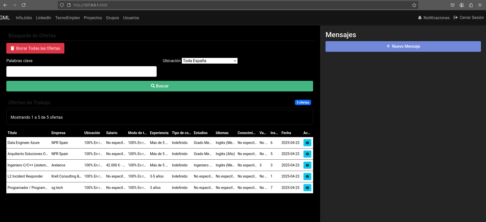
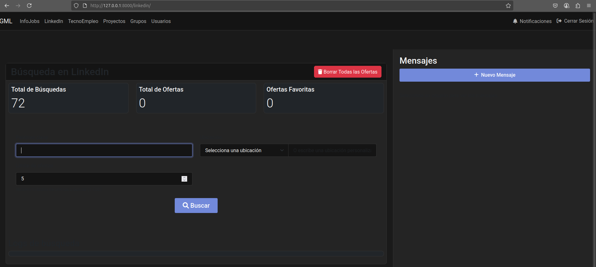
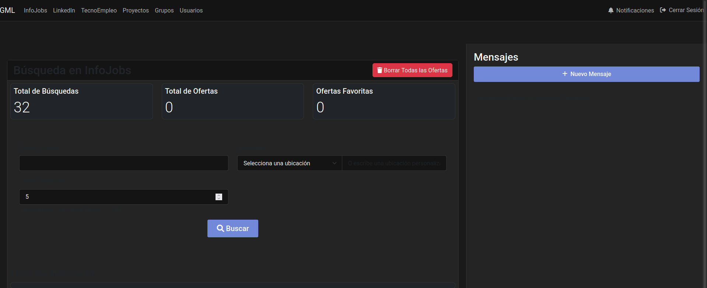
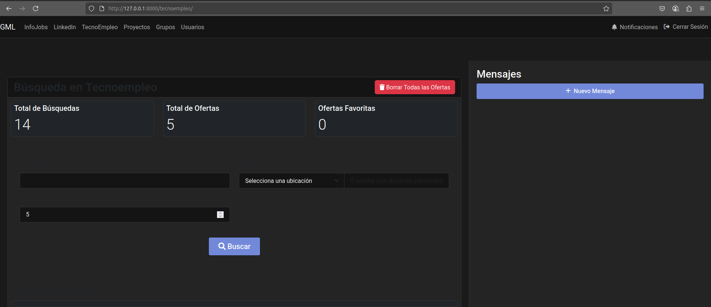
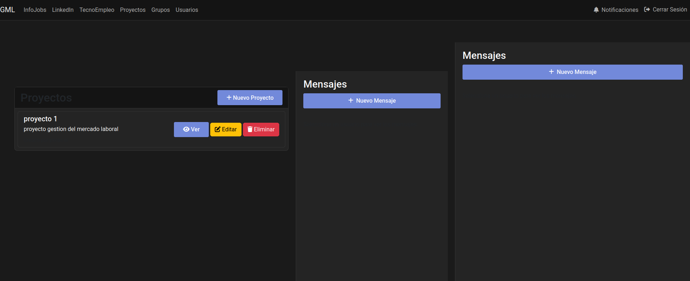
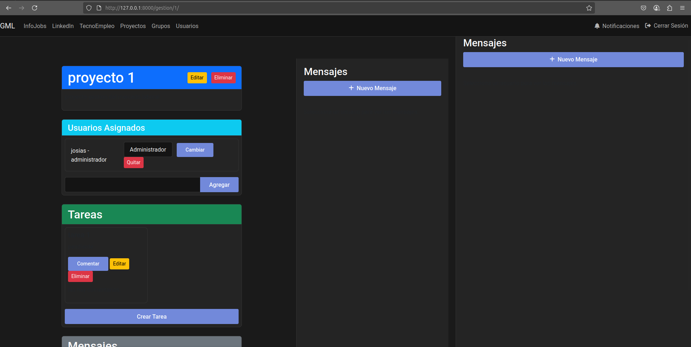
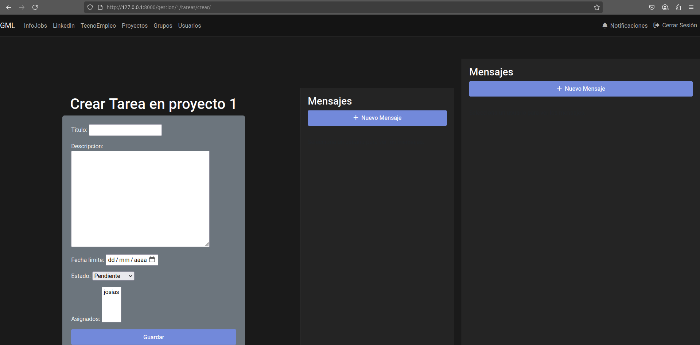
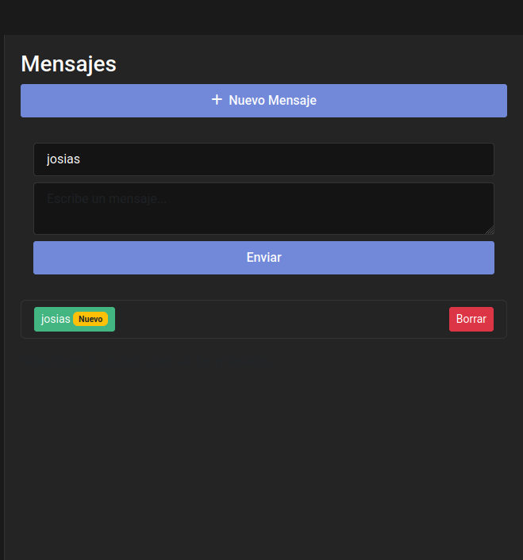
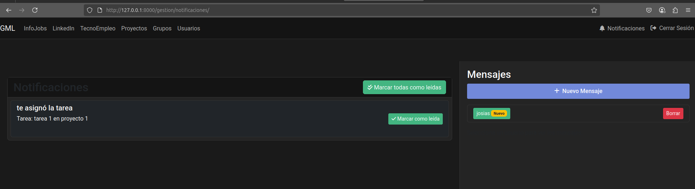
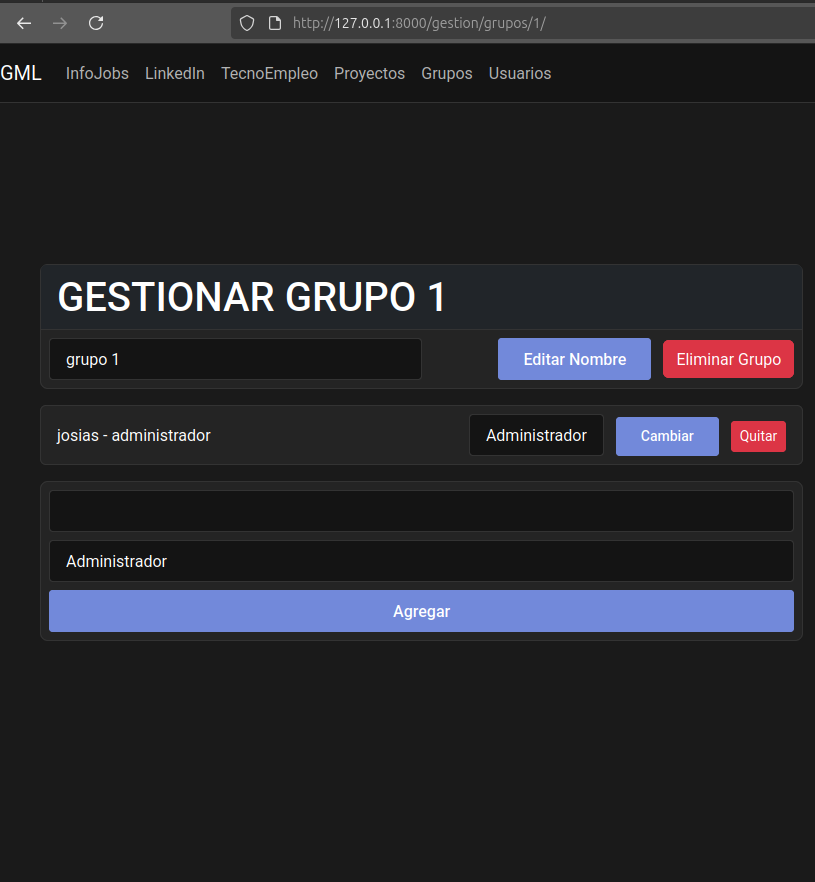

# Templates de GML

## Índice
1. [Dashboard](#dashboard)
2. [Búsqueda](#búsqueda)
3. [Sistema de Comunicación Empresarial](#sistema-de-comunicación-empresarial)

## Dashboard

- Tabla principal con columnas:
  - Título (enlace a la oferta)
  - Empresa
  - Ubicación
  - Salario
  - Modo de trabajo
  - Experiencia
  - Tipo de contrato
  - Estudios
  - Idiomas
  - Habilidades
  - Vacantes
  - Inscritos
  - Fecha de publicación
- Filtros superiores
- Paginación inferior

## Búsqueda
### LinkedIn

- Formulario de búsqueda:
  - Campo de palabras clave
  - Selector de ubicación
  - Campo de ubicación personalizada
  - Selector de límite de resultados
  - Botón de búsqueda
- Área de resultados:
  - Lista de ofertas encontradas
  - Log de búsqueda
  - Indicador de carga

### InfoJobs

- Formulario similar al de LinkedIn
- Resultados específicos de InfoJobs

### TecnoEmpleo

- Formulario específico para TecnoEmpleo
- Visualización de resultados

## Sistema de Comunicación Empresarial
### Dashboard

- Lista de proyectos activos
- Tareas pendientes
- Notificaciones recientes
- Mensajes no leídos
- Accesos rápidos a:
  - Crear proyecto
  - Ver tareas
  - Mensajes
  - Grupos

### Proyectos

- Lista de proyectos con:
  - Título
  - Descripción
  - Fecha de inicio
  - Fecha de fin
  - Estado
  - Usuarios asignados
- Botones de acción:
  - Crear proyecto
  - Editar proyecto
  - Eliminar proyecto
  - Ver detalles

### Tareas

- Lista de tareas con:
  - Título
  - Descripción
  - Estado
  - Fecha límite
  - Asignados
  - Proyecto
- Botones de acción:
  - Crear tarea
  - Editar tarea
  - Eliminar tarea
  - Marcar como completada

### Mensajería

- Mensajes privados
- Mensajes de proyecto
- Bandeja de entrada
- Mensajes enviados
- Crear nuevo mensaje

### Notificaciones

- Lista de notificaciones
- Estado (leído/no leído)
- Tipo de notificación
- Fecha
- Acción asociada

### Grupos

- Lista de grupos
- Miembros
- Roles
- Permisos
- Acciones de grupo

